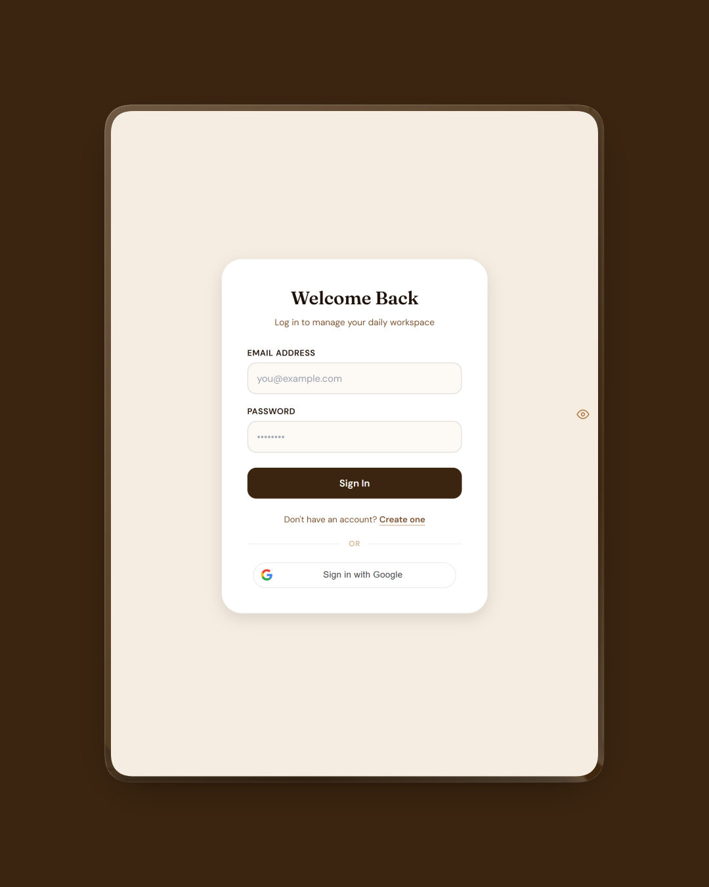
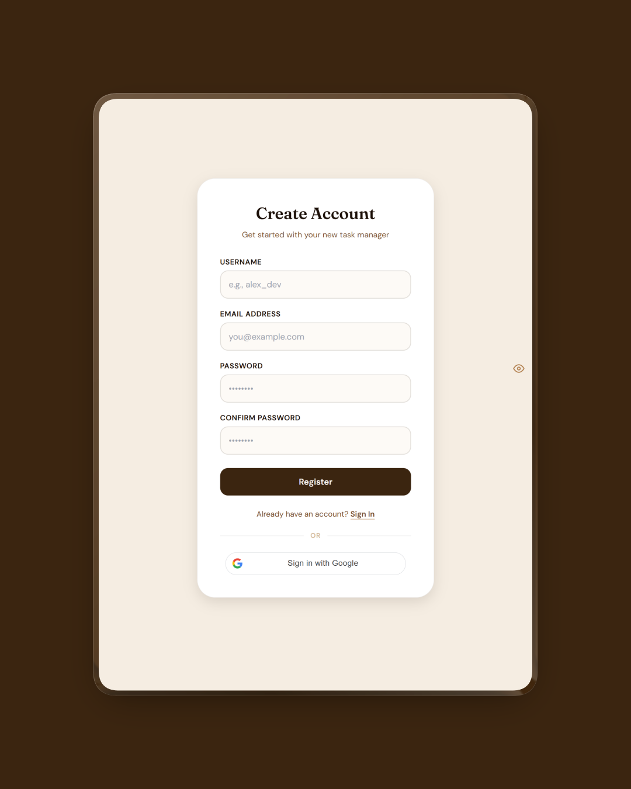
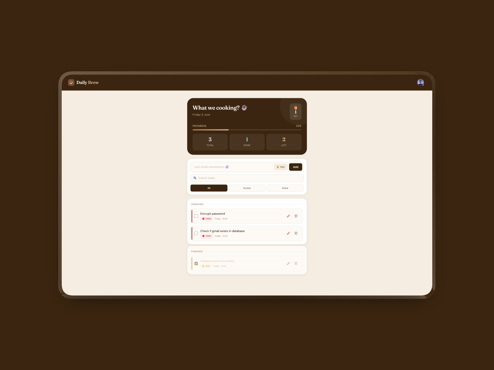

# Task Manager

A full-stack task management application designed to help users organize daily activities, improve productivity, and manage workloads efficiently. The platform provides secure authentication, seamless Google Sign-In, and a clean interface for creating and managing tasks.

## 🚀 Live Demo

**Live Application:** https://your-live-demo-url.com

---

## 📸 Screenshots

### Authentication

Capture the following screens:

* Login page with email/password fields
* Google Sign-In button
* Registration page
* Responsive mobile layout
* Clean authentication flow without validation errors





**Tips:**

* Keep forms centered and uncluttered
* Ensure Google OAuth button is fully visible
* Use realistic sample email addresses
* Capture pages in their default state

---

### Dashboard

Capture the main task management workspace showing:

* Task list with multiple tasks
* Create Task form/modal
* Completed and pending tasks
* Edit/Delete task actions
* User profile or navigation area



**Tips:**

* Populate with realistic tasks before taking screenshots
* Include both completed and pending tasks
* Capture the full workspace layout
* Avoid empty-state screenshots

---

## ✨ Features

* User authentication with JWT
* Google OAuth Sign-In
* Create, update, and delete tasks
* Protected routes
* Persistent user sessions
* Responsive user interface
* Secure password hashing
* RESTful API architecture

---

## 🛠 Tech Stack

### Frontend

* React 19
* React Router DOM
* Axios
* Vite
* @react-oauth/google

### Backend

* Node.js
* Express.js
* MongoDB
* Mongoose

### Authentication & Security

* JWT Authentication
* Google OAuth
* bcrypt Password Hashing
* Protected API Routes

### Deployment

* Vercel (Frontend)
* Render / Railway (Backend)
* MongoDB Atlas (Database)

---

## 🏗 Architecture

```text
React Frontend
       │
       ▼
Express API
       │
       ▼
MongoDB Atlas
```

---

## 🔑 Key Technical Challenges Solved

### Authentication System

Implemented secure JWT-based authentication with support for both traditional email/password login and Google OAuth Sign-In.

### Route Protection

Built protected client-side and server-side routes to ensure only authenticated users can access task management features.

### OAuth Integration

Integrated Google Sign-In using Google's OAuth APIs and verified tokens securely on the backend.

### State Management

Maintained authentication state across page refreshes and route transitions for a seamless user experience.

---

## 📡 API Endpoints

### Authentication

```http
POST /auth/register
POST /auth/login
POST /auth/googleLogin
```

### Tasks

```http
GET    /tasks
POST   /tasks
PUT    /tasks/:id
DELETE /tasks/:id
```

---

## ⚙️ Local Setup

### Clone Repository

```bash
git clone https://github.com/yourusername/task-manager.git
cd task-manager
```

### Backend Setup

```bash
cd server
npm install
npm run dev
```

### Frontend Setup

```bash
cd frontend
npm install
npm run dev
```

---

## 🔧 Environment Variables

### Backend (.env)

```env
PORT=5000
MONGO_URI=your_mongodb_connection_string
JWT_SECRET=your_jwt_secret
GOOGLE_CLIENT_ID=your_google_client_id
```

### Frontend (.env)

```env
VITE_API_URL=http://localhost:5000
```

---

## 🚧 Future Improvements

* Task categories and labels
* Due dates and reminders
* Task priority levels
* Team collaboration
* Dark mode
* Drag-and-drop task organization
* Mobile application support

---

## 👤 Author

**Rhokeeb Sanni**

GitHub: https://github.com/rhokeebsanni
